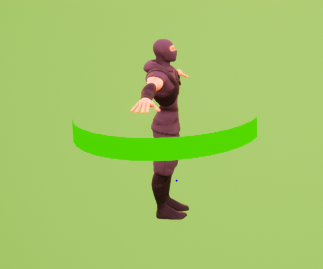

## 1.前言

继续学习ue4~这两天根据[3D HealthBar](https://www.youtube.com/watch?v=F9pWJZZxyk0)这个视频实现了3D的血条，记录下过程。

<!-- more -->

## 2.实现过程
这个血条实现的教程主要是3个部分：

### i.mesh

3d血条的半圆环mesh，这个是直接导入的素材，设置如下：


### ii.material


血条的material是使用材料蓝图实现的，大致思路是使用TextCoord实现蒙版的公式，对横坐标的计算公式为

```mathematica
f(x) = clamp[0,1]((1 - (x + 0.5 + param)) * 50)
```

函数结果大致可以看作x<0.5-param时，返回1，x>=0.5-param时，返回0，通过调整param从-0.5到0.5，便可以实现血条长度从100%到0%，使用变量health换算至对应param就可以实现对血条长度的控制。

颜色则也是通过param控制的。param约小，血条越长，因此RGB中的G需要越大，R需要越小，G值时G-param，R值是R+param，再将param+0.6修正初始值便得到了颜色公式。


最后新建材质参数集MFC_Health，代替param，并新建材质实例应用到mesh上。

### iii.pawn


最后一部分是将血条绑定至游戏角色上，并将hp百分比值通过公式由100至0线性换算成对应的-0.5至0.5的param。上图是实现了AdjustHealthBar的函数，将hp百分比通过公式计算param：

```mathematica
 param = -hp / 100 + 0.5
```


实现函数后，通过键入Q和E调整Health的值输入AdjustHealthBar进行测试。

按教程实现后，效果如下：


发现血条是从右边起的，因为教程中的血条是放在主角前方的，在我们这个视角中看起来就反过来了，因此需要修改下公式。

### iv.修改
**修改材质：**

蒙版的UV公式需要反过来：

```mathematica
f(x) = clamp[0,1]((1 - (x + 0.5 + param)) * 50)
=>
f(x) = clamp[0,1]((x - 0.5 + param)) * 50)
```

因此修改后蓝图变为：


**修改AdjustHealthBar函数：**

由于公式正负值反了过来，param和health的线性关系正负值也需要反过来：


## 3.最终效果

最终实现的效果大致如下：

初始时为一个半圆弧，颜色是绿色。


随着血量降低，圆弧长度较少，颜色逐渐偏黄，最后变红。

