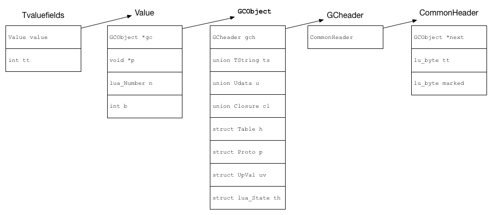

Lua作为一门嵌入式的脚本语言，可以绕过编译这一漫长的步骤、可以很轻松地热加载，并且可以嵌入各种语言系统，因此很多游戏项目中会使用Lua。我们项目中前后端共用的代码和一些改动频率比较大、对效率没那么敏感的代码都会使用Lua实现。

而Lua有个重要特性是弱类型，而且Lua是C语言实现的，对此有点好奇，因此这次想来研究下。

<!-- more -->

##1.Lua数据的结构

Lua是弱类型的脚本语言，因此Lua的所有数据类型需要有个统一的、通用的数据结构去保存，并且需要在使用时区分数据类型。Lua实现使用了一个变量记录数据的类型，然后使用union保存具体的数据。

Lua最终形成的是一个TValue的结构体：

```cpp
typedef struct lua_TValue {
  TValuefields;
} TValue;
```

从下图可以看到TValue的结构：



可以一层一层看下每个成员的作用。

### i.TValuefields

```cpp
#define TValuefields Value value; int tt
```

最外层是一个TValueFields的宏。包含了一个Value和tt。tt是int值，记录了数据的数据类型。

### ii.Value

```cpp
typedef union {
  GCObject *gc;
  void *p;
  lua_Number n;
  int b;
} Value;
```

Value是负责记录数据的结构，但是Lua中的类型分需要GC（Garbage Collection）和不需要GC的，而需要GC的类型需要一些数据来支持GC机制，因此这类数据就被包装在GCObject这个类型中，而其余不需要GC的则直接放作为联合体的其他成员包含在Value对象里。

以下是Lua中所有的数据类型：

* **Lua中的数据类型**

| 宏                 | 类型            | 数据结构           |
| :----------------- | --------------- | ------------------ |
| LUA_TNONE          | 无类型          | 无                 |
| LUA_TNIL           | 空类型          | 无                 |
| LUA_TBOOLEAN       | 布尔类型        | int                 |
| LUA_TLIGHTUSERDATA | 指针            | void *             |
| LUA_TNUMBER | 数据            | lua_Number             |
| LUA_TSTRING        | 字符串          | TString            |
| LUA_TTABLE         | 表              | Table              |
| LUA_TFUNCTION      | 函数            | CClosure、LClosure |
| LUA_TUSERDATA      | 指针            | void *             |
| LUA_TTHREAD        | Lua虚拟机、协程 | lua_State          |

Lua中判断类型是否需要GC是通过iscollectable接口判断是否需要GC。

``` cpp
// 5.1: 
#define ttype(o) ((o)->tt_)
#define iscollectable(o)  (ttype(o) >= LUA_TSTRING)
// 5.4:
#define BIT_ISCOLLECTABLE  (1 << 6)
#define rawtt(o)	((o)->tt_)
#define iscollectable(o)	(rawtt(o) & BIT_ISCOLLECTABLE)
```

可以看到5.1中，LUA_TSTRING开始的都是需要GC的，所以这些数据都包含在GCObject中，而上面的除空的数据分别对应了结构中的b，n和p成员。而5.4中已经变为使用tt的第六位来判断，可能是为了处理一些特殊情况。

### iii.GCObject

```cpp
union GCObject {
  GCheader gch;
  union TString ts;
  union Udata u;
  union Closure cl;
  struct Table h;
  struct Proto p;
  struct UpVal uv;        
  struct lua_State th;  /* thread */
};
```

GCObject是个联合体，除GCheader外每个成员对应了所有需要GC的数据类型，每个类型的结构体定义开头都是一个CommonHeader，里面包含了GC相关的数据。GCheader的结构如下，只有一个CommonHeader，所以当你只需要GC相关数据时就可以使用gch这个成员。

```cpp
#define CommonHeader GCObject *next; lu_byte tt; lu_byte marked
typedef struct GCheader {
  CommonHeader;
}
```

可以看到GCheader中有三个成员：

* next：Lua的GC机制中会有一个链表管理需要GC的对象，指向GC链表的下一个成员。

* tt：表示数据的类型。

* marked：GC相关的标记位。

##2.总结

Lua语法十分简洁，且是速度最快的脚本语言之一，实现用的还是相当难掌控的C，其设计还是有很多精巧之处的，接下来还会接着研究。

### **参考文章**

* 《Lua设计与实现》——codedump

* [lua 5.3.5 TValue::tt_和GCObject::tt之间的爱恨纠葛](https://blog.csdn.net/weixin_42973416/article/details/103881589)
