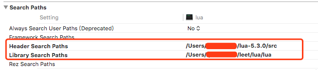
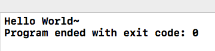
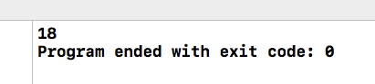

##1.前言

<!-- more -->

## 2.交互原理

c++和lua交互主要是通过Lua的堆栈,一方将传递的参数以及参数个数压入栈中,另一方则在栈中取出参数,并将返回值压入栈中,由另一方取出,实现交互.这个过程和c++和汇编(如nasm)的交互过程很像.

## 3.调用环境搭建

我是在macos上实验的,过程应该和linux上类似.

### (i).添加依赖

将liblua.a添加到项目中:


设置search paths:

	Header Search Paths设置为lua安装位置,用来搜索头文件.

	Library Search Paths设置为项目存放.a库的目录.



### (ii).代码测试

``` c++
#include <iostream>

extern "C" {
#include "lua.h"
#include "lualib.h"
#include "lauxlib.h"
}

using namespace std;

int main()
{
    //1.创建一个state
    lua_State *L = luaL_newstate();
    //2.入栈操作
    lua_pushstring(L, "Hello World~");
    //3.取值操作
    if (lua_isstring(L, 1)) { //判断是否可以转为string
        cout << lua_tostring(L, 1) << endl; //转为string并返回
    }
    //4.关闭state
    lua_close(L);
}
```

### (iii).运行代码

运行结果:



##4.c++调用lua

### (i).求和代码:

lua代码:

``` lua
function Sum(a, b)
  return (a+b);
end
```

c++代码:

``` c++
#include <iostream>

extern "C" {
#include "lua.h"
#include "lualib.h"
#include "lauxlib.h"
}

using namespace std;

int main()
{
    //创建Lua状态
    lua_State *L = luaL_newstate();
    if (L == NULL)
    {
        return 0;
    }
    
    //加载Lua文件
    int bRet = luaL_loadfile(L, "sum.lua");
    if (bRet)
    {
        cout << "load file error" << endl;
        return 0;
    }
    
    //运行Lua文件
    bRet = lua_pcall(L, 0, 0, 0);
    if (bRet)
    {
        cout << "pcall error" << endl;
        return 0;
    }
    //读取函数
    lua_getglobal(L, "Sum");        // 获取函数，压入栈中
    lua_pushinteger(L, 10);          // 压入参数
    lua_pushinteger(L, 8);          // 压入参数
    int iRet = lua_pcall(L, 2, 1, 0);// 调用函数，调用完成以后，会将返回值压入栈中，第一个2表示参数个数，第二个1表示返回结果个数。
    if (iRet)                       // 调用出错
    {
        const char *pErrorMsg = lua_tostring(L, -1);
        cout << pErrorMsg << endl;
        lua_close(L);
        return 0;
    }
    if (lua_isinteger(L, -1))        //取值输出
    {
        int sum = lua_tointeger(L, -1);
        cout << sum << endl;
    }
    
    //关闭state
    lua_close(L);
    return 0;
}

```

结果:



