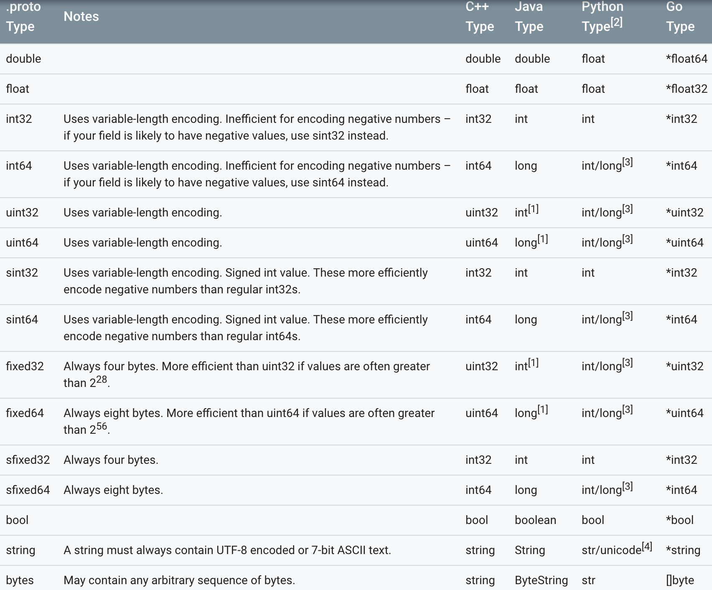

上次学习了protobuf的安装，今天开始学习使用。以下例子也主要以C++为主。（ps：由于protobuf是谷歌推出的，所以下文给出文档需要翻墙~）

<!-- more -->

## 1.定义.proto
使用protobuf序列化对象首先需要将对象的数据结构定义到.proto文件中。

以下是官网给出的一个例子。

addressbook.proto:

```
syntax = "proto2";  // 使用proto2语法

package tutorial;  // 声明包名，为了解决不同项目中的重名的问题，类似于命名空间

/* 定义Person的message，类似于class */
message Person {
  required string name = 1;  // 定义的数据项，定义中字段较多，具体在后面解释。
  required int32 id = 2;
  optional string email = 3;

  // 支持枚举类
  enum PhoneType {
    MOBILE = 0;
    HOME = 1;
    WORK = 2;
  }

  // message的定义可以嵌套
  message PhoneNumber {
    required string number = 1;
    optional PhoneType type = 2 [default = HOME]; // 可以[default = xxx]的语法指定默认值
  }

  repeated PhoneNumber phones = 4;
}

message AddressBook {
  repeated Person people = 1;
}
```

可以看到.proto的总体语法和java、c++等OO语言很相近。主要区别应该在数据项的声明，下面就来详细学习下~

***

### required、optional、repeated
首先，任意数据项必须要有`required`、`optional`或`repeated`的一个来修饰：

1. `required`：声明成required的数据项在存取时需要有赋值，在没有赋值的情况下这些数据项会被视作“未初始化”。当libprotobuf的库在debug模式下，若required的数据项没有赋值，在存储数据时会强制停止。在优化模式下，会跳过这个检查直接写入数据。但读取时，若required的数据项没有赋值，读取总会失败。
2. `optional`：声明成optional的数据项可以不进行赋值，未赋值的数据项会使用默认初始值，该初始值可以自己指定，也可以使用系统默认初始值。
3. `repeated`：声明成repeated的数据项可能会在存储的数据结构中出现n个（包括0个）。简单来说就相当于动态大小的数组，像c++中的vector和java中的ArrayList。

### 类型和名称
数据项需要声明数据类型和名称，这和那些强类型语言是一样的。

protobuf中的数据类型和其他语言的对应关系见下图：


### 编号
数据项最后会有一个`= 1`、`= 2`这样的编号。这些编号是用来在二进制文件中唯一标识每一个数据项的tag，要保证每个message内的各个数据项的tag不同。其中1-15的tag占用的空间比16及以上的tag少一个字节，所以常用的一些属性最好以1-15去标识。（repeated的属性每一条都会需要在二进制文件中保存一个tag，所以repeated的属性应尽可能使用1-15的tag）

***

以上是对这份样例代码的解析，还有一些其他语法可以参考[官方文档](https://developers.google.com/protocol-buffers/docs/proto)

## 2.编译.protobuf
编写好.protobuf文件以后，可以通过protobuf的编译器对其进行编译并生成c++、java等目标代码。

以c++为例，可以使用以下指令编译：
```
$ protoc -I=. --cpp_out=. addressbook.proto
```

`-I=xxx`是源代码所在目录，`--cpp_out=xxx`是c++文件输出目录，第三个参数`addressbook.proto`是要编译的.proto文件。

使用以上指令则会在cpp_out指定目录中生成两个文件：addressbook.pb.cc、addressbook.pb.h。

.h文件则是我们代码中可以调用的接口，.cc文件是接口的实现，我们不能修改，也不需要关心。
***
以上是编写和编译.proto文件的过程，具体在代码中使用会在下一篇blog中介绍。
