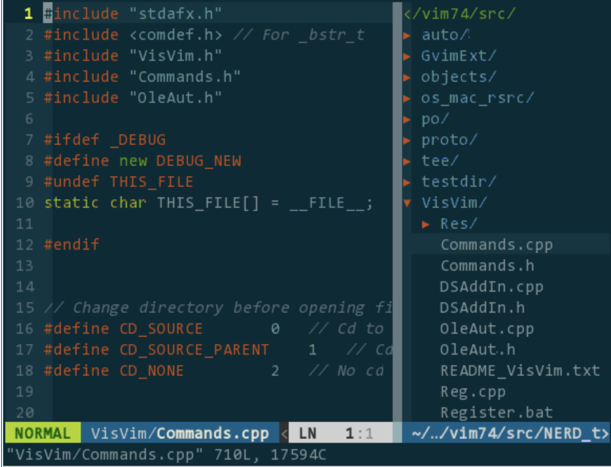
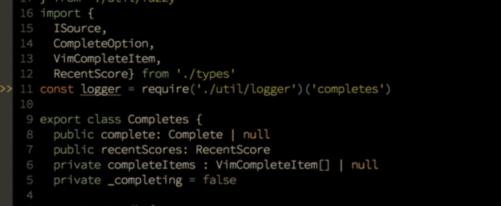

经过几个礼拜的实习,终于有点熟悉公司的环境了.我在公司的工作环境大致如下:

* 语言:		主要使用**c++**,还会有一些**lua、go**等语言
	 编辑器:	**vim**
	 编译器:	**gcc**,编译时使用Makefile
	 版本控制:	**git、svn**,代码的管理主要通过git,配置文件的管理主要通过svn
	 调试工具:	**gdb**

从刚开始什么都不会,编码、调试什么的都无从下手,现在终于能够上手了.以下总结一下这几个礼拜中的一些心得,主要是一些开发时的技巧.(以下截图都是网上找的,因为公司代码不方便放出来~)

<!-- more -->

## 1.vim

当初觉得vim真的很难用,我们用的是macOS,所以当初准备用xcode或者sublime来编码,然后编译完传到服务器上.但实际操作时发现,这样是无法实现的.

首先,我们的项目实在过于庞大,光编译和运行就分别得用将近10分钟,想本地编码和编译然后上传服务器本身就是一件效率很低的事情.而且实际项目运行环境是linux,我们的项目中也有用到linux的库,所以在macOS上是无法编译运行的.所以最高效的方法还是直接在远程主机上使用vim编码.

在使用了一段时间vim后,接触到一些技巧后,会发现vim其实也可以像一款ide一样.这里有一篇很棒的文章: [所需即所获：像 IDE 一样使用 vim](https://blog.csdn.net/GarfieldEr007/article/details/52234175).介绍了很多vim使用的配置和插件,对安装和使用方法介绍的很好.所以接下来我就大概简单地介绍下我用到的.

以下是我一些常用的插件或技巧:

### vundle

vundle是vim下一个管理插件的一种方式.可以通过在vim配置文件中添加插件的声明来安装vim插件,有点类似于java项目中的maven,对于插件管理非常有帮助

### NERDTree

NERDTree是一款vim的插件,可以以可视化的方式查看文件,并可以对文件进行新建、删除等简单操作.同时nerdtree也可以支持多文件分屏浏览.

nerdtree

### YCM

YCM(YouCompleteMe)是一个静态代码分析工具,非常好用.它可以像ide一样智能提示,实现自动补全.同时,他可以检查出代码中的语法错误,错误代码会高亮显示,并在行首有">>"提示符,虽然实际用下来感觉能报的错很有限.

ycm

### ctags

ctags可以对项目中的变量、函数、类生成tags,通过tags你可以在代码中选择跳转到光标所在的变量、函数、类定义的地方.但他不方便的地方在于每次写完代码需要重新生成,否则跳转时可能回到错误的地方.

## 2.gdb

### gdb -pid

以前只用过gdb直接编译运行代码,在大型项目中是无法实现的.这时候要需要使用gdb的-pid参数.

使用`gdb -pid 进程号`指令便可以attach到运行中的c++项目,之后操作便和正常gdb一样了.

### stl

在调试时,常常需要检查stl的内容,当容器中内容较多时,无法很好地去查看内容.此时,可以使用[这篇文章](https://www.cnblogs.com/silentNight/p/5466418.html)中的技巧,便可以查看stl容器中内容了~
